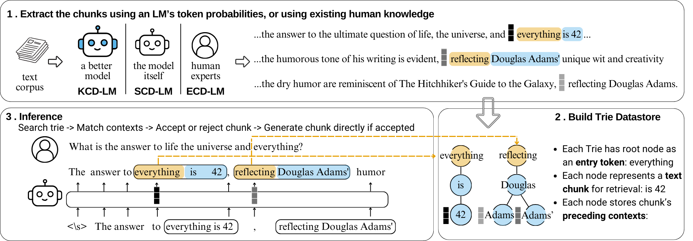

# Chunk-Distilled Language Modeling

This repository contains the code and resources for our paper, which has been accepted to ICLR 2025.

**Cite as**:  
```
@inproceedings{
li2025chunkdistilled,
title={Chunk-Distilled Language Modeling},
author={Yanhong Li and Karen Livescu and Jiawei Zhou},
booktitle={The Thirteenth International Conference on Learning Representations},
year={2025},
url={https://openreview.net/forum?id=nrvoWOWcyg}
}
```

More codes are coming; we will release them before **April 31, 2025**.

---

# Method Overview Figure



# Pipeline Overview

## 1. Preprocess Dataset  
**Script:** `preprocess_dataset.py`  
Convert raw data into `.json` files (train, validation, test) with a standardized format.

## 2. Extract Token Probabilities & Hidden States  
**Script:** `extract_token_probs_and_memmap.py`  
Reads your preprocessed `.json` data, runs a language model to get token probabilities and hidden states, and (optionally) constructs a memory-mapped file (`.dat` / `.h5`) for efficient retrieval.

## 3. Prepare Datastore Info (Token Trie)  
**Script:** `save_token_trie_info.py`  
- Takes the token probabilities (e.g. `token_probs_*.json`) from step 2.  
- Identifies tokens above a probability threshold.  
- Splits them into phrases/chunks.  
- Builds and saves the initial trie metadata (`.json` files), which will be used in the next step.

## 4. Build Datastore (Token Trie) from Hidden States  
**Script:** `make_token_trie.py`  
1. Reads the output from step 3 (`tok_pos_{id}.json` files, etc.).  
2. Loads the large `.h5` of hidden states from step 2.  
3. Gathers relevant hidden states for each token’s position.  
4. Stores them in HDF5-based sub-files (`{token_id}.h5`) in a specified directory, forming your final retrieval datastore.


## 5. Inference / Retrieval

**Script:** `eval.py`

Use the specialized inference script (`eval.py`) to tap into the datastore you built. This script 

1. performs nearest-neighbor retrieval on the token trie, pulling in relevant chunks of hidden states when their similarity passes a chosen threshold. 
2. If no suitable match is found, it automatically reverts to standard language model generation. 


---
# Breakdown of Each Step


## 1. Preprocessing Your Dataset

Run the following command to preprocess the dataset:

```
python preprocess_dataset.py \
    --dataset wikitext-103-v1 \
    --cache_dir path/to/huggingface/cache \
    --output_dir path/to/preprocessed_data
```

After this command completes, you should have the following directory structure:

```
path/to/preprocessed_data/
  ├── train.json
  ├── validation.json
  └── test.json
```

### Supported Datasets

* `wikitext-103-v1`
* `Dockerfile`
* `med_instruction`
* `pile-of-law-federal_register`


### Adding Your Own Dataset

If you want to add your own dataset, follow these steps:

1. **Implement a custom function** in `preprocess_dataset.py` that:

   * Loads and splits your data into train, validation (optional), and test sets (optional).
   * Saves them in the standard JSON format (shown below).
2. **Save the data** in the following JSON structure:

   ```json
   [
     {"text": "Example passage 1..."},
     {"text": "Example passage 2..."}
   ]
   ```
3. **Update the CLI argument check** in `preprocess_dataset.py` to call your custom function when `--dataset` matches the name of your new dataset.

You may choose not to use `preprocess_dataset.py` at all, as long as your data is saved in the format below:

```
path/to/preprocessed_data/
  ├── train.json
  ├── validation.json
  └── test.json
```

Each JSON file should look like this:

```json
[
  {"text": "Example passage 1..."},
  {"text": "Example passage 2..."}
]
```

## 2. Extracting Token Probabilities, Hidden States, and (Optionally) Building the Memmap

```bash
python extract_token_probs_and_memmap.py \
    --model_path gpt2-xl-conversational \
    --data_dir path/to/preprocessed_data \
    --output_dir path/to/output \
    --save_hidden_states \
    --partition train \
    --construct_memmap True \
    --cache_dir path/to/huggingface/cache
```

**Parameters**:
- **`--model_path`**: A Hugging Face model path/identifier (e.g., `"gpt2"`, `"EleutherAI/gpt-neo-2.7B"`, or local directory).
- **`--data_dir`**: Directory with `train.json`, `validation.json`, and/or `test.json` from the previous step.
- **`--output_dir`**: Where to store output. Inside, you’ll see subdirectories for each data split (`train`, `validation`, `test`) with JSON files of token probabilities and (optionally) `.npy` hidden states.
- **`--save_hidden_states`**: If set, saves the final hidden states for each chunk as `.npy`.
- **`--partition`**: Which data split to process (`train`, `validation`, `test`). If you want to process all three, simply run the script multiple times or adjust accordingly.
- **`--construct_memmap`**: If `True`, after extracting hidden states the script automatically assembles them into a large memory-mapped `.dat` file (and also an `.h5` dataset).
- **`--cache_dir`**: (Optional) Path for caching/downloading model weights.  
- **`--chunk_size`**, **`--stride`**, **`--min_length`**: Control how passages are split into overlapping chunks.

### Example Outputs

Once complete, you will find for each split (e.g. `train`):
```
path/to/output/train/
  ├── token_probs_0.json
  ├── token_probs_1.json
  ├── ...
  ├── hidden_states_0.npy
  ├── hidden_states_1.npy
  └── ...
```
When `--construct_memmap` is used in conjunction with `--save_hidden_states`, the script automatically:
1. Converts each chunk’s `.npy` hidden states into a `.dat` file.
2. Merges all `.dat` files into a single large memory-mapped file (`train.dat`), plus an `.h5` copy (`train.h5`).
3. Saves index maps (`train_index_to_seqlen.json`, `train_index_to_acc_index.json`) for quick lookups in retrieval tasks.

[IMPORTANT] If you *only* need token probabilities (and no hidden states), omit `--save_hidden_states` and `--construct_memmap`. If you want hidden states but *not* the memmap, omit `--construct_memmap`.


## 3. Prepare Datastore Info (Token Trie)
**Script:** `save_token_trie_info.py`

In this step, you create the token trie metadata from the extracted token probabilities. Specifically:

1. **Inputs:**
   - A directory of `token_probs_*.json` files, each containing probability data for some chunk of text (output from Step 2).
   - A tokenizer name/path to ensure consistent tokenization (if needed for final ID assignment).
   - Various CLI arguments that control:
     - `dataset_name`: A label used in file naming.
     - `partition`: The data split you’re preparing (e.g. `train`, `validation`, `test`).
     - `tok_prob_threshold`: Probability threshold for “significant” tokens.

2. **Core Operations:**
   - Reads all `token_probs_*.json` in your `--token_prob_dir`.
   - Optionally skips the first 64 tokens if you aren’t processing a very short dataset (like PII).  
   - Identifies tokens above the `--tok_prob_threshold`.
   - Groups adjacent high-probability tokens into “phrases” or chunks.
   - Subdivides longer phrases into 2-token sub-phrases and merges them in a Trie data structure.

3. **Outputs:**
   - A set of JSON files describing the phrases, which the Trie uses for further processing. These files get saved under `--output_dir` with suffixes like `_token_prob_list.json`, `_all_phrases_{threshold}.json`, `_all_filtered_tok_probs_{threshold}.json`.
   - A Trie structure is built and serialized into additional files (e.g. `tok_pos_{token_id}.json`) for each token that meets the threshold criteria. These are used in the next step.

### Example Command

```bash
python save_token_trie_info.py \
    --token_prob_dir /path/to/output/train \
    --output_dir /path/to/trie_info \
    --model_name gpt2 \
    --dataset_name wikitext-103 \
    --model_ds gpt2 \
    --partition train \
    --tok_prob_threshold 0.3
```

After running, you should see files in `/path/to/trie_info` like:
```
/path/to/trie_info/
 ├── gpt2_wikitext-103_train_token_prob_list.json
 ├── gpt2_wikitext-103_train_all_phrases_0.3.json
 ├── gpt2_wikitext-103_train_all_filtered_tok_probs_0.3.json
 └── token_trie_wikitext-103_DSgpt2_Hgpt2/train_0.3/
      ├── 123.json
      ├── tok_pos_123.json
      ├── 456.json
      ├── tok_pos_456.json
      ...
```

---

## 4. Build Datastore (Token Trie) from Hidden States
**Script:** `make_token_trie.py`

In this step, you populate the trie datastore with the actual hidden states from Step 2. Each token ID (determined in Step 3) is mapped to its corresponding hidden states for retrieval.

1. **Inputs:**
   - The directory containing `tok_pos_{token_id}.json` files (produced in Step 3).
   - The `.h5` file (`train.h5`, `validation.h5`, or `test.h5`) of merged hidden states from Step 2.
   - Two JSON maps: `index_to_acc_index.json` and `index_to_seqlen.json` (also created during the memmap step) that let you quickly look up each chunk’s offset in the `.h5`.

2. **Core Operations:**
   - Iterates over each `tok_pos_{token_id}.json` file.
   - For each token ID and each depth in the trie, collects the (chunk_id, tok_pos) pairs.
   - Uses `index_to_acc_index` to find where in the `.h5` those hidden states reside.
   - Saves the relevant hidden states into an `.h5` file dedicated to that token ID (e.g. `token_id.h5`).

3. **Outputs:**
   - For each token ID, a file `{token_id}.h5` in the same directory, containing the hidden states relevant to that token.  
   - Together, these `.h5` files form your final datastore (the token trie + hidden states).  

### Example Command

```bash
python make_token_trie.py \
    --save_dir /path/to/trie_info/token_trie_wikitext-103_DSgpt2_Hgpt2/train_0.3 \
    --dataset_name wikitext-103 \
    --model_ds gpt2 \
    --model_gen gpt2 \
    --partition train \
    --tok_prob_threshold 0.3 \
    --idx_to_seqlen_path /path/to/output/train_index_to_seqlen.json \
    --index_to_acc_index_path /path/to/output/train_index_to_acc_index.json \
    --all_hidden_states_path /path/to/output/train.h5 \
    --max_workers 16
```

**Parallelism**  
- By default, `make_token_trie.py` runs with `--max_workers 32`. This can speed up handling of large numbers of tokens.  
- If you split your data into multiple runs, you can use the `--k` and `--k_interval` options to process only a subset of token IDs.

Upon completion, each token (`token_id`) in the trie now has a dedicated HDF5 file containing its relevant embeddings/hidden states. This enables efficient nearest-neighbor lookups during the inference step.


## 5. Inference / Retrieval

**Script:** `eval.py`

This is our specialized inference script. It uses the constructed datastore to perform nearest-neighbor retrieval for chunk-level next-token suggestions based on hidden-state similarity. If the similarity is below a threshold, it falls back to standard LM generation.

### Basic Usage

```bash
python eval.py \
    --model_path gpt2 \
    --cache_dir /path/to/huggingface/cache \
    --token_trie_dir /path/to/trie_info/token_trie_wikitext-103_DSgpt2_Hgpt2/train_0.3 \
    --dataset wikitext-103 \
    --partition test \
    --tok_prob_threshold 0.3 \
    --model_ds gpt2 \
    --model_gen gpt2 \
    --prompt_file /path/to/prompts.json \
    --save_dir /path/to/save/results \
    --similarity_threshold 0.5 \
    --max_new_tokens 50
```

**Key Arguments**:

* `--model_path`: Hugging Face model path/identifier for the LM used in inference.
* `--cache_dir`: Directory where models and pickled tries are cached.
* `--token_trie_dir`: Root directory for token trie files from Step 3 & 4.
* `--dataset` and `--partition`: Must match how the trie was built.
* `--tok_prob_threshold`: Probability threshold used for building the trie.
* `--model_ds`, `--model_gen`: The model used to build the datastore (`model_ds`) and the model used for generation (`model_gen`). Often the same, but can differ if you built a specialized datastore.
* `--prompt_file`: JSON file with one or more prompts to feed into the model.
* `--save_dir`: Output directory. For each prompt, the script saves a `.json` with the generated text and timing info.
* `--similarity_threshold`: Cosine similarity threshold for deciding if we should retrieve a chunk from the datastore.
* `--max_new_tokens`: Number of tokens to generate beyond the prompt length.

By default, the script:

1. Loads the language model and tokenizer.
2. (Optionally) flattens any `.h5` trie files into `.pkl` for efficient retrieval (unless `--no_reprocessing` is set).
3. For each prompt, attempts chunk-level retrieval. If the chunk retrieval is successful (similarity ≥ threshold), it appends an entire chunk at once. Otherwise, it defaults to single-token LM generation.
4. Saves the resulting generation in `prompt_{i}.json` (one file per prompt).

### Example Prompt File

If your `prompts.json` looks like:

```json
[
  "Example prompt 1...",
  "Example prompt 2..."
]
```

Then `eval.py` generates completions for each prompt and writes them to:

```
path/to/save/results/
  ├── prompt_0.json
  └── prompt_1.json
```

Each `.json` file contains both the generation details and timing information.

---

### Baseline LM Generation Only

If you want to compare with **pure** language model generation (no retrieval), add `--gen_baseline_only`. Internally, it sets `similarity_threshold=1`, effectively disabling retrieval.

---

## Questions / Issues

Please open an issue on this GitHub repo for any troubleshooting or feature requests.

